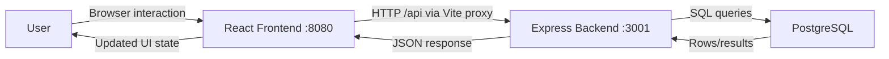

# CARP Tech

## App Summary
CARP Tech helps beginner technology users, especially older adults, learn everyday digital skills through simple tutorials. Many users are left behind by tools that assume prior technical experience. This app addresses that gap with plain-language lessons, step-by-step objectives, and a clean interface focused on confidence-building. Users can browse tutorials, open guided lesson flows, and track progress through each lesson step. The current backend milestone adds real server and database behavior so key actions are no longer frontend-only. Specifically, the settings flow now updates user passwords in PostgreSQL through API calls. This project is moving from prototype behavior to persistent full-stack functionality.

## Tech Stack
- Frontend: React, TypeScript, Vite, Tailwind CSS, shadcn/ui, React Router
- Backend: Node.js, Express
- Database: PostgreSQL (`pg` driver)
- Authentication: JWT (login/register/me endpoints)
- External services/APIs: none
- Tooling: ESLint, Vitest, concurrently, dotenv

## Architecture Diagram


## Prerequisites
- Node.js (LTS): https://nodejs.org/en/download
- npm (included with Node): https://docs.npmjs.com/downloading-and-installing-node-js-and-npm
- PostgreSQL: https://www.postgresql.org/download/
- `psql` CLI on PATH: https://www.postgresql.org/docs/current/app-psql.html
- Git: https://git-scm.com/downloads

Verify installations:
```bash
node -v
npm -v
psql --version
git --version
```

## Installation and Setup
1. Clone and enter the repository.
```bash
git clone https://github.com/phoenixfisher/carptech.git
cd carptech
```

2. Install dependencies.
```bash
npm install
```

3. Create a local environment file.
```bash
cp .env.example .env
```

4. Update `.env` with your PostgreSQL username/password if needed.

5. Make sure PostgreSQL is running, then run setup.
```bash
npm run setup
```

Note: this branch currently initializes database tables and seed users from server code (`server/index.js`) instead of `db/schema.sql` and `db/seed.sql`.

## Running the Application
Run frontend and backend together:
```bash
npm run dev
```

Open:
- Frontend: `http://localhost:8080`
- Backend API base: `http://localhost:3001/api`

## Verifying the Vertical Slice
The implemented vertical slice is the existing **Reset Password** button in Settings.

1. Start the app with `npm run dev`.
2. Open `http://localhost:8080/login`.
3. Log in using a seeded account:
- `user` / `user`
- `admin` / `admin`
4. Open Settings from the user dropdown in the navbar.
5. Submit the reset password form and click `Reset Password`.
6. Confirm the request hits backend endpoint `POST /api/auth/change-password` in browser DevTools.
7. Verify data changed in PostgreSQL:
```bash
psql -d carptech -c "SELECT username, password_hash, created_at FROM users ORDER BY id;"
```
8. Log out, then log in again with the new password to confirm persistence.

## Deliverable Reminder
- Share the GitHub repository with `taforlauracutler`.
- Submit a direct link to this README in your assignment comments.
